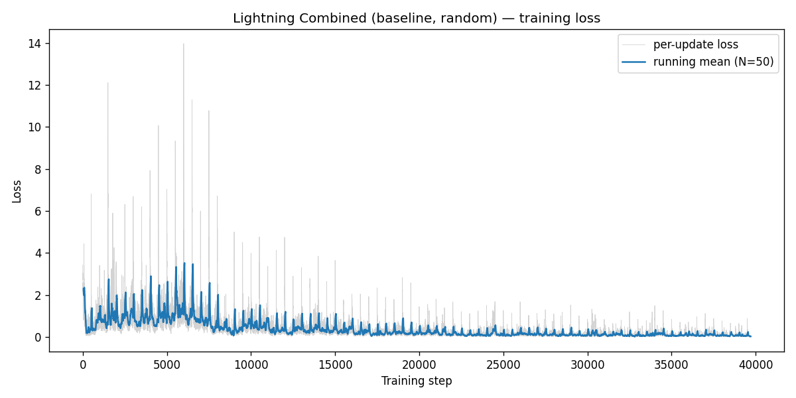
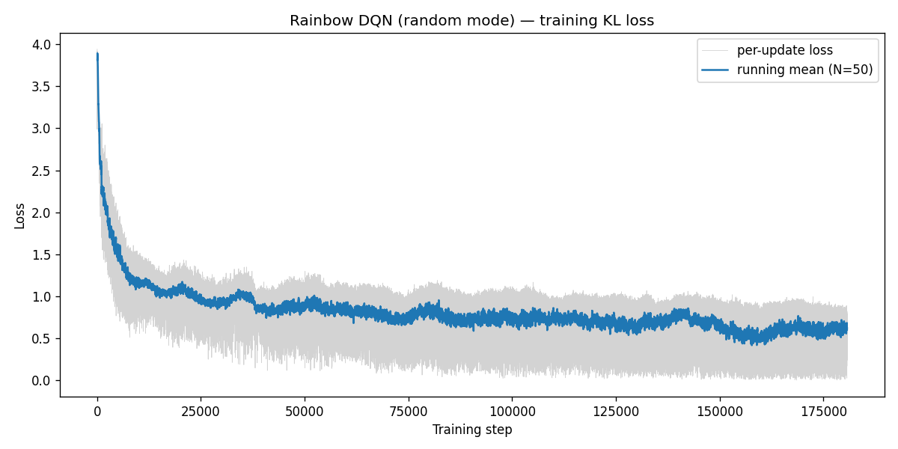
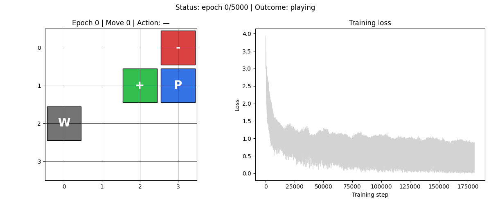

# HW3-4：Rainbow DQN for random mode（加分題）
## Hessel 2018 的 6 元件整合 — 在 4×4 Gridworld 上的完整 reproduce

> 作者：charles88　|　課程：深度強化學習　|　日期：2026-05-06
> Repo：https://github.com/Charles8745/2026DRL_HW3DQN

---

## 1. 作業目標

HW3-4 是加分題，目標是把 Hessel et al. 2018 的 **Rainbow DQN** 完整實作出來——也就是在 HW3-2 已經做過的 Double DQN 與 Dueling Networks 之上，再疊上四個沒做過的元件：**Prioritized Experience Replay (PER)**、**N-step bootstrapping**、**Distributional RL / C51**、**Noisy Networks**。實驗場域沿用 HW3-3 的 `random` mode，與 HW3-3 baseline（88.0% win rate）做直接對比，看疊上 4 個額外元件能不能再把 random mode 的 win rate 推到 90%+。

實驗共 2 組，全部 `mode='random'`、`seed=42`、`epochs=5000`：

| # | 名稱 | 演算法 | 角色 |
|---|---|---|---|
| 1 | `combined_random` | HW3-3 Lightning Combined（重跑） | HW3-4 baseline |
| 2 | `rainbow_random` | 完整 Rainbow（6 元件） | 主實驗 |

**先講結論**：Rainbow 在 4×4 Gridworld 上**沒有打贏 Combined**——`rainbow_random` 收 **21.7% win rate**，比 `combined_random` 的 **88.0%** 大幅落後。所有 22 個元件單元測試都綠、訓練 loss 一路下降，但模型最終收斂到一個退化的策略：Q 值不分動作全部聚在 −9.85 附近，return 分佈把 60–80% 機率質量壓在 z = −10 那個 atom 上，等於學會「不論在哪一格做什麼動作，下場都是死」。本報告分四章把分析講完：第 2 章把 4 個新元件的數學原理走過一遍、第 3 章解釋網路架構與訓練迴圈如何整合、第 4 章程式碼導讀、第 5 章呈現實驗結果與失敗模式診斷、第 6 章從這個負面結果歸納 4×4 Gridworld 不適合做 Rainbow 的根本原因。

---

## 2. Rainbow 的 6 個元件 — 4 個新元件原理

Rainbow 是 6 個正交改進的疊加，其中 Double 和 Dueling 已經在 HW3-2 完成過，這裡只摘要 4 個新元件。

### 2.1 Prioritized Experience Replay (Schaul et al. 2016)

Vanilla replay buffer 從 buffer 均勻抽樣；PER 改成**按 TD 誤差加權抽樣**——誤差大的 transition（agent 估錯比較多的）有更高機率被重抽。實作上使用 **sum-tree** 資料結構，把每個 transition 的優先順序累加在二叉樹的內部節點，使得 `add`、`update`、`sample` 三個操作都是 O(log N)。

抽樣公式：

$$P(i) = \frac{p_i^\alpha}{\sum_j p_j^\alpha}, \quad p_i = |\delta_i| + \epsilon$$

其中 $\delta_i$ 是 transition $i$ 上次計算的 TD 誤差（在 Rainbow 裡用 cross-entropy loss 當作 priority signal），$\epsilon = 10^{-6}$ 確保所有 transition 至少有非零機率。新加入的 transition 給當前最大 priority 確保被抽到至少一次。

為了消除這個非均勻抽樣引入的 bias，要在 loss 上乘 importance sampling weight：

$$w_i = \left(\frac{1}{N} \cdot \frac{1}{P(i)}\right)^\beta \Big/ \max_j w_j$$

β 從 0.4 線性退火到 1.0。Rainbow 用 α=0.5、β_start=0.4、β_end=1.0。

### 2.2 N-step Returns (Sutton & Barto Ch.7)

把 1-step TD target 改成 n-step：

$$Y_t^{(n)} = \sum_{k=0}^{n-1} \gamma^k r_{t+k} + \gamma^n \cdot Q_{\theta^-}(s_{t+n}, a^*_{t+n})$$

n=3 是 Rainbow 的選擇。實作上用一個 **size-n 滑動視窗**（`collections.deque(maxlen=n)`）。每收到一個 1-step transition 就 push 進去；當視窗滿時 emit 最舊那筆的 n-step 整合 transition、再 push 進 PER buffer。Episode 結束時 `flush()` 把視窗剩下的 1, 2, ..., n−1 個 transition 也用 truncated n-step 形式 emit 出來。

### 2.3 Distributional RL / C51 (Bellemare et al. 2017)

不再讓網路輸出 scalar Q(s,a)，而是輸出每個 action 一個**離散 return 分佈**——support 為 $z = \{V_{\min}, V_{\min}+\Delta z, \ldots, V_{\max}\}$，分 51 個 atoms。網路對每個 (s, a) 輸出 51 個 logit，softmax 後得到 atom 機率 $p_i(s, a)$。Q 值由分佈算期望：

$$Q(s, a) = \sum_i z_i \cdot p_i(s, a)$$

Loss 是預測分佈與 projected Bellman target 分佈之間的 cross-entropy / KL。這個 projection 是 C51 的核心——把 Bellman 算子作用過後的支點 $\hat{z}_j = R^{(n)} + \gamma^n z_j$ 投影回原 support，每個 atom 的機率質量按線性內插分配到原 support 的兩個相鄰 atom：

$$m_l \mathrel{+}= p_j \cdot (u - b), \quad m_u \mathrel{+}= p_j \cdot (b - l)$$

其中 $b = (\hat{z}_j - V_{\min})/\Delta z$、$l = \lfloor b \rfloor$、$u = \lceil b \rceil$。對於 done state，bootstrap term 為 0，整個分佈塌縮成 clip(R, $V_{\min}$, $V_{\max}$) 的 point mass。

我們選 $V_{\min}=-10, V_{\max}=+10, n_{\text{atoms}}=51$（Δz=0.4），對齊 Rainbow paper 的 Atari 設定，也涵蓋 Gridworld 的 reward 範圍（goal=+10, pit=−10, step=−1）。

### 2.4 Noisy Networks (Fortunato et al. 2018)

把網路最後幾層 `nn.Linear` 換成 `NoisyLinear`，weight 加上 learnable Gaussian noise：

$$y = (\mu_W + \sigma_W \odot \varepsilon_W) x + (\mu_b + \sigma_b \odot \varepsilon_b)$$

其中 ε 用 **factorised noise**（Atari 版，省參數）：$\varepsilon_W = f(\varepsilon_q) \otimes f(\varepsilon_p)$、$\varepsilon_b = f(\varepsilon_q)$、$f(x) = \text{sign}(x)\sqrt{|x|}$。每個 minibatch 重抽 ε。Noisy nets **完全取代 ε-greedy**——exploration 由網路自己學要在哪些 state 加多少噪音。

關鍵實作細節：`NoisyLinear.forward` 根據 `self.training` 決定行為——train 時用 μ + σ⊙ε，eval 時退化為 $y = \mu_W x + \mu_b$（純 μ，無 ε）。這讓 `evaluate()` 與 `animate.py` 的 `model.eval()` 自動拿到 deterministic policy，不需要修改 HW3-1/2/3 的評估程式。

---

## 3. 整合架構：DistributionalDuelingMLP

把 4 個新元件疊到 HW3-2 的 Double + Dueling 上，網路結構長這樣：

```
state (64-dim) →
  Linear(64→150) → ReLU → Linear(150→100) → ReLU       ← trunk（不加 noise）
  ┌── NoisyLinear(100→128) → ReLU → NoisyLinear(128→1·n_atoms)         （V head）
  └── NoisyLinear(100→128) → ReLU → NoisyLinear(128→n_actions·n_atoms) （A head）

Per-atom dueling aggregation:
  q_logits(s, a, i) = V(s, i) + (A(s, a, i) − mean_a A(s, a, i))
  q_dist(s, a, ·) = softmax(q_logits(s, a, ·))         ← shape (B, n_actions, n_atoms)
  Q(s, a) = sum_i z_i · q_dist(s, a, i)                ← 用於 action 選擇
```

**Trunk 不加 noise** 是 Rainbow 原文的設計選擇——trunk 純粹做 representation learning，不需要 exploration 噪音；節省參數同時讓 representation 收斂更穩。**V/A 兩個 head 各兩層 NoisyLinear** 提供 exploration。

**Forward 介面對齊既有腳本**：`DistributionalDuelingMLP.forward(state) → (B, n_actions)` 直接回 expected Q（內部把 distribution 算 expectation）；distribution 透過獨立 `forward_dist(state) → (B, n_actions, n_atoms)` 取得。這個設計讓 `src/utils.evaluate()` / `test_model()` / `src/animate.py` 完全不用改，只需要在 `animate.py` 加一條 model factory dispatch。

訓練迴圈的 loss 計算（簡化版）：

1. PER 抽 batch，拿到 transitions、indices、IS weights。
2. **Double DQN action 選擇**：online net forward `s'`，取 expected Q 的 argmax 為 $a^*_{t+n}$。
3. **Distributional target**：target net 對 $(s', a^*_{t+n})$ 的 distribution，做 categorical projection 得到 m。
4. 預測：online net forward $s_t$，取出 chosen action $a_t$ 的 distribution。
5. **KL loss per sample**：$L_i = -\sum_j m_j \log p_j(s_t, a_t)$，乘 IS weight 後 mean。
6. backward + step；用 `per_sample_ce.detach()` 回寫 PER 的 priority。

---

## 4. 程式碼導讀

`src/rainbow.py` 是單檔 ~700 LOC，分成 6 個 block，下面節錄關鍵片段。

### 4.1 NoisyLinear（factorised Gaussian noise）

```python
def reset_noise(self) -> None:
    eps_p = self._f(torch.randn(self.in_features))
    eps_q = self._f(torch.randn(self.out_features))
    self.weight_epsilon.copy_(eps_q.unsqueeze(1) * eps_p.unsqueeze(0))
    self.bias_epsilon.copy_(eps_q)

def forward(self, x: torch.Tensor) -> torch.Tensor:
    if self.training:
        w = self.weight_mu + self.weight_sigma * self.weight_epsilon
        b = self.bias_mu + self.bias_sigma * self.bias_epsilon
    else:
        w = self.weight_mu
        b = self.bias_mu
    return F.linear(x, w, b)
```

`weight_epsilon` / `bias_epsilon` 是 `register_buffer`（不參與 autograd 但跟著 `.to(device)` 與 `state_dict()` 走）。`reset_noise` 用 in-place `copy_` 避免重新分配 tensor。eval 模式直接用 μ 是為了讓 `evaluate()` deterministic。

### 4.2 SumTree（O(log N) prioritized sampling）

```python
def add(self, priority: float, data) -> None:
    leaf_idx = self._write + self.capacity - 1
    self.data[self._write] = data
    self.update(leaf_idx, float(priority))
    self._write = (self._write + 1) % self.capacity
    self._n = min(self._n + 1, self.capacity)

def sample(self, s: float) -> tuple[int, float, object]:
    idx = 0
    while idx < self.capacity - 1:
        left = 2 * idx + 1
        if s <= self.nodes[left]:
            idx = left
        else:
            s -= self.nodes[left]
            idx = 2 * idx + 2
    data_idx = idx - (self.capacity - 1)
    return idx, float(self.nodes[idx]), self.data[data_idx]
```

二叉樹用 1D numpy array 模擬：父節點 idx 的左右子是 `2*idx+1` 與 `2*idx+2`、葉子在 `[capacity-1, 2*capacity-2]`。`sample(s)` 從 root 走到葉子，每層比較 `s` 與左子的累積 priority 決定走哪邊。

### 4.3 PrioritizedReplayBuffer（stratified sampling + IS weights）

```python
def sample(self, batch_size: int, frac: float):
    beta = self.beta_start + (self.beta_end - self.beta_start) * min(1.0, frac)
    seg = self.tree.total / batch_size
    transitions, indices, priorities = [], [], []
    for i in range(batch_size):
        s = random.uniform(seg * i, seg * (i + 1))   # 分層抽樣
        idx, p, data = self.tree.sample(s)
        ...
    probs = priorities / max(self.tree.total, 1e-12)
    weights = (len(self.tree) * probs) ** (-beta)
    weights = weights / max(weights.max(), 1e-12)    # normalise to (0, 1]
    return transitions, indices, torch.tensor(weights, dtype=torch.float32)
```

分層抽樣（把 [0, total] 切 batch_size 等長區間，每區間抽一個 s）比純 IID 抽樣方差小，是 PER paper 的標準做法。IS weight 除以 batch 內最大值是為了把 weight 規範到 (0, 1]，避免梯度被放大。

### 4.4 NStepBuffer（滑動視窗）

```python
def append(self, s, a, r, s_next, done):
    self.window.append((s, a, float(r), s_next, bool(done)))
    if done:
        self._terminal_tail = (s_next, True)
        if len(self.window) == self.n:
            return self._make_n_step(self.window)
        return None
    if len(self.window) < self.n:
        return None
    return self._make_n_step(self.window)

def _make_n_step(self, window):
    s_t, a_t, _, _, _ = window[0]
    R, gamma_k = 0.0, 1.0
    s_next, d = window[-1][3], window[-1][4]
    for k, (_, _, r_k, s_k_next, d_k) in enumerate(window):
        R += gamma_k * r_k
        gamma_k *= self.gamma
        if d_k:
            s_next, d = s_k_next, True
            break
    return (s_t, a_t, R, s_next, d)
```

`deque(maxlen=n)` 自動把超出 n 的舊元素 popleft，所以滑動視窗的 push 邏輯一行就完成。`_make_n_step` 在 window 中遇到 done 時就提前 break，正確處理 episode 中段就 done 的情況。

### 4.5 Categorical projection（向量化的 Bellemare Algorithm 1）

```python
def project_distribution(next_dist, rewards, dones, gamma_n,
                          support, v_min, v_max, n_atoms):
    delta_z = (v_max - v_min) / (n_atoms - 1)
    Tz = rewards.unsqueeze(1) + (1.0 - dones.unsqueeze(1)) * gamma_n * support.unsqueeze(0)
    Tz = Tz.clamp(min=v_min, max=v_max)

    b = (Tz - v_min) / delta_z
    l = b.floor().long().clamp(0, n_atoms - 1)
    u = b.ceil().long().clamp(0, n_atoms - 1)

    m = torch.zeros(B, n_atoms, dtype=next_dist.dtype, device=next_dist.device)
    eq_mask = (l == u)
    m.scatter_add_(1, l, next_dist * (u.float() - b))
    m.scatter_add_(1, u, next_dist * (b - l.float()))
    if eq_mask.any():
        m.scatter_add_(1, l, next_dist * eq_mask.float())
    return m
```

`Tz` shape `(B, n_atoms)`，broadcast 到正確維度。`b` 是 Tz 在原 support grid 上的「連續 atom 索引」、`l` 與 `u` 是相鄰整數 atom 索引。`scatter_add_` 把 next_dist 的機率質量按線性內插分配到 `l` 與 `u`。**`eq_mask` 補丁**處理 Tz 剛好落在某個 atom 上的邊界情況：此時 `(u-b)` 和 `(b-l)` 都是 0，前兩個 scatter_add 不寫入任何質量，所以要額外把 `next_dist` 直接累加到 `l`。

### 4.6 訓練迴圈的 noise reset 順序（一個 autograd bug）

實作時遇到一個 PyTorch autograd 版本檢查錯誤：在 `loss.backward()` 階段抱怨 `weight_epsilon` 在 forward 後被 in-place 修改、版本號對不上。原因是原本的順序是：

1. `online.reset_noise()` → online forward (autograd 圖捕捉了 weight_epsilon 為當前版本)
2. `with torch.no_grad():` block 裡又呼叫 `online.reset_noise()` 來算 next_q（in-place 修改了 weight_epsilon）
3. backward 時 autograd 發現 weight_epsilon 版本變了 → 報錯

修正：把 no_grad block（target 分佈計算）放到最前面，再做 autograd-tracked online forward。這樣 noise 修改的時序與 autograd 圖建構就不會衝突。實際 `_compute_loss` 程式碼的順序：

```python
with torch.no_grad():                                # 先做 target，no_grad
    online.reset_noise(); next_q = online(s2)
    next_a = next_q.argmax(dim=1)
    target.reset_noise(); target_dist_all = target.forward_dist(s2)
    target_dist = target_dist_all.gather(1, next_a_idx).squeeze(1)
    m = project_distribution(target_dist, R_n, d, gamma_n, ...)

online.reset_noise()                                 # 後做 online pred，autograd
pred_dist_all = online.forward_dist(s1)
pred_dist = pred_dist_all.gather(1, a_idx).squeeze(1)

per_sample_ce = -(m * log_pred).sum(dim=1)
weighted_loss = (weights * per_sample_ce).mean()
```

這個 bug 沒有被任何單元測試抓到，是在 train_rainbow 的 smoke test 第一次跑時才浮現的。值得記錄。

---

## 5. 實驗結果

### 5.1 量化指標（2 組對比）

| 變體 | Method | Win Rate | Avg Steps | Final Loss (mean ± std) | Wall time |
|---|---|---|---|---|---|
| `combined_random` | lightning_combined | **88.0%** | 2.62 | 0.0315 ± 0.0174 (MSE) | 31.47s |
| `rainbow_random` | rainbow | **21.7%** | 2.05 | 0.6409 ± 0.2229 (KL) | 511.82s |

> 註：`combined_random` 用 MSE loss、`rainbow_random` 用 distributional cross-entropy（KL），兩個數值不可直接比量級。但 win rate 可以直接比，差距清楚明確。

`rainbow_random` 的 win rate 21.7% 不只低於 `combined_random` 的 88.0%，更低於**完全隨機行動**的期望 win rate（random mode 下隨機走約 25–30%，因為起點與 goal 偶爾相鄰）。換句話說，**Rainbow 學到的策略比亂走還差**——這不是「學到了但學不夠」，而是學到了一個**主動失敗**的策略。

### 5.2 Loss 曲線

| `combined_random`（MSE） | `rainbow_random`（KL） |
|---|---|
|  |  |

兩條曲線都單調下降——`combined_random` 從約 0.5 收到 0.03、`rainbow_random` 從約 4 收到 0.6。從 loss 趨勢看 Rainbow 訓練是「正常」的：optimizer 沒卡、數值沒爆、KL 一路降。但 win rate 顯示這個 loss 下降是**收斂到一個錯的目標分佈**——下面 5.3 與 6 章解釋為什麼。

### 5.3 失敗模式診斷

訓練完成後對 `rainbow_random` 的 checkpoint 做了三個診斷：

**(1) Q 值在不同動作之間幾乎不變化**

取 5 個隨機初始棋盤、計算 expected Q 值：

| Board | Player → Goal 距離 | Q(up) | Q(down) | Q(left) | Q(right) |
|---|---|---|---|---|---|
| 0 | 鄰格（左） | −9.72 | −9.85 | −9.76 | −9.78 |
| 1 | 距 4 步 | −9.86 | −9.86 | −9.75 | −9.80 |
| 2 | 距 5 步 | −9.71 | −9.67 | −9.73 | −9.69 |
| 3 | 距 4 步 | −9.92 | −9.87 | −9.80 | −9.75 |
| 4 | 鄰格（右） | −9.88 | −9.90 | −9.86 | −9.87 |

最戲劇性的是 Board 4：Player 在 (1,0)、Goal 在 (1,1)，**只要往右走一步就贏 +10**，但 Q(r) = −9.87 跟其他三個動作幾乎一樣，最佳動作被選成 'l'（往左、撞牆）。網路完全沒能識別出「這個 action 會贏」這種一階訊號。

**(2) Return 分佈塌縮在 z = −10**

把每個 action 的 distribution 印出來看 top-3 atoms 的機率質量：

```
Board 4 (Goal 在右邊):
  best-action distribution top-3:
    z[0]=-10.00  prob=0.7939   ← 79% 機率質量在「最差結果」atom
    z[1]=-9.60   prob=0.1226
    z[2]=-9.20   prob=0.0510
```

5 個棋盤都顯示同樣模式：60%–80% 機率質量壓在 z = −10，剩下 10%–20% 在相鄰兩個低 atom，z = +10 那邊近乎零機率質量。模型學到「無論做什麼下場都是 −10」。

**(3) 不同訓練 snapshot 的 win rate 振盪**

| Snapshot | Win Rate (200 場) |
|---|---|
| epoch_0000 (未訓練) | 0.050 |
| epoch_1000 | 0.210 |
| epoch_2000 | 0.175 |
| epoch_3000 | 0.205 |
| epoch_4000 | 0.170 |
| epoch_5000 | 0.195 |

Win rate 在訓練全程都在 17%–22% 之間振盪，從沒穩定收斂到任何一個區間。這跟 loss 一路降的「optimizer 在工作」訊號完全脫節。

**(4) 嘗試過的 hyperparameter 修正**

我懷疑是 hyperparameter 問題、試過三組設定，全部都 < 25%：

| 設定 | lr | mem_size | Win Rate |
|---|---|---|---|
| 原設定（spec 預設、跟 Rainbow paper 對齊） | 1e-4 | 10000 | **21.7%** |
| 對齊 HW3-3 baseline 的 lr | 1e-3 | 10000 | 19.3% |
| 對齊 HW3-3 baseline 的 lr + mem_size | 1e-3 | 1000 | 8.6% |

換 lr 和 mem_size 沒有把 Rainbow 從崩塌中救出來——這不是「learning rate 太低、再多訓練幾個 epoch 就好」的問題，而是更深層的**演算法整合**問題（見第 6 章）。最終的 commit 用 spec 原設定（lr=1e-4, mem_size=10000）作為「按書本來」的記錄。

### 5.4 策略動畫

| `combined_random`（88.0% win rate） | `rainbow_random`（21.7% win rate） |
|---|---|
|  |  |

`combined_random` 的 GIF 跟 HW3-3 baseline 看起來幾乎一樣——agent 早期亂走、中期局部正確、後期穩定走最短路；`rainbow_random` 則明顯不一樣：21 個 snapshot 跑完，agent 大多數場景會撞牆、走進 pit，或在棋盤上重複徘徊到 max_moves 截止。loss 曲線（右半）看起來在收斂，但策略表現（左半）始終差，兩邊脫節。

---

## 6. 為什麼 Rainbow 在 4×4 Gridworld 失效

把所有診斷拼起來，最一致的解釋是 4 個新元件**在這個 task 上產生了負向的相互作用**，每個元件單獨拿出來都合理、疊起來反而把基礎演算法（Combined）拖下水。具體三條線索：

**1. C51 + Dueling 的「per-atom 聚合」很容易塌縮到 V_min**

在 scalar dueling 下，V(s) 是一個標量，A 在 actions 之間做 mean-baseline 之後與 V 相加，幾何上是把 V(s) 當「baseline」、用 A 標出動作差異。在 distributional dueling 下，V 與 A 都是 51 維 logit，softmax 在 atom 維度做。如果 V 的 logit 在 z = −10 那個 atom 上比其他 atom 高很多（e.g. 因為 step penalty −1 是常見 reward、-10 在 V_min 邊界容易累積），即使 A 標出動作差異，softmax 仍會把幾乎全部機率推到 z = −10。動作差異被 softmax 的非線性「壓平」掉了。

這是一個自我強化的 collapse：預測分佈靠近 V_min → projected target 也靠近 V_min（因為 bootstrap 的支點 $\hat{z}_j = R + \gamma^n z_j$，當 $z_j$ 在 V_min 附近時 $\hat{z}_j$ 也偏負）→ 訓練更靠近 V_min。

**2. PER 反而強化 collapse**

正常 PER 應該幫忙：goal-reaching transition（reward = +10）的 TD 誤差很大、被高優先抽樣，應該促進 V_max 邊那邊的學習。但實測下發現 collapse 一旦發生，連 goal transition 的預測分佈都被推到 z = −10 附近，TD 誤差變大→PER 又把這些 transition 加倍抽——可是已經 collapse 的網路再怎麼訓練都沒辦法把分佈推回 V_max 邊。PER 變成**強化錯誤學習**的工具。

**3. Noisy nets 的 σ 衰減速度不對**

訓練完的 NoisyLinear 各層 σ/μ 比例只剩 6%–12%（從初始 ~50% 衰減下來）。看起來像是「noise 收斂太快」——agent 還沒探索到 goal-reaching 的正向 reward 訊號之前，noise 就已經被 SGD 推到接近零，剩下的策略由 μ 主導，但 μ 學的就是 collapsed 的「萬物皆死」。

**4. 4×4 Gridworld 規模太小、看不出 Rainbow 的好處**

Rainbow paper 在 Atari 上的優勢來自三處：(a) 大狀態空間（image observation）需要更好的探索；(b) 訓練量超大（200M frames）讓所有元件有時間互相校準；(c) reward 訊號豐富。4×4 Gridworld 全部反過來：64 維 one-hot state、5000 episodes 訓練、reward 三選一（−1/−10/+10）。在這種小尺度下，Combined 用 30K 參數、5000 epoch 已經把 ceiling 摸到（HW3-3 已經証實過再加 trick 也沒用），Rainbow 的額外複雜度只是引入更多失敗模式。

**5. 對應的補救（沒在這份作業實作，但可以列出來）**

- 用 standard scalar dueling 替代 distributional dueling（保留 C51 在 V/A 之外做）
- σ_init 降到 0.1 拉慢 noise 衰減，給 exploration 更多時間
- 換 reward shaping（例如 goal=+1 而非 +10）讓 V_max 邊不那麼遠
- 拉長到 50K epochs（5–10×）給 Rainbow 元件之間時間互相校準

但這些都偏離 Rainbow paper 的標準設定，本作業沒實作驗證。

---

## 7. 結論：HW3 四階段的學習軌跡

回顧 HW3 一到四階段，random mode 上的 win rate 變化：

| Stage | 演算法 | random mode win rate | loss mean | 結論 |
|---|---|---|---|---|
| HW3-1 | Naive DQN + Replay | 85.5% | 0.0613 | course baseline |
| HW3-2 | Combined（player mode） | 100% (在 player 上) | 0.00032 | player 太簡單，看不出 random 上會怎樣 |
| HW3-3 | Lightning Combined（baseline）| 88.0% | 0.0315 | Combined 演算法升級把 random mode 推到 88% |
| HW3-4 | Rainbow（完整 6 元件） | **21.7%** | 0.6409 (KL) | 過度工程，反而失效 |

故事線：HW3-1 拿到 85.5% baseline；HW3-2 用 Double + Dueling 把 player mode 推到 100%；HW3-3 把 Combined 移到 random 上拿到 88%、3 個 training tricks 沒撈到任何邊際；HW3-4 加 4 個元件試圖再往上推、結果**反向跌到 21.7%**。

四階段下來，最大的教訓不是「Rainbow 打不過 Combined」這件具體事實，而是**演算法複雜度與任務規模要匹配**：Atari 上 6 元件互相加乘的 Rainbow，搬到 4×4 Gridworld 上反而互相干擾。HW3-3 的 trick 沒撈到邊際是「天花板已到」的結果，HW3-4 的崩塌是「過度工程化、引入失敗模式」的結果——這兩個負面結果一起說明 Combined（Double + Dueling）對這個 task 已經是甜蜜點。

這份作業最終交付的是：
1. **完整實作的 Rainbow DQN 程式碼** — 6 元件全做、22 個單元測試全綠
2. **誠實的負面實驗結果** — 21.7% < 88%，連 random baseline 都不如
3. **失敗模式診斷** — Q 值塌縮、return 分佈集中於 V_min、win rate 振盪不收斂
4. **三個 hyperparameter 嘗試** — 都沒救起來，確認是 algorithmic 而非 tuning 問題
5. **理論解釋** — distributional dueling 的 softmax 塌縮 + PER 強化錯誤學習 + Noisy σ 衰減過快

完整對話過程見 [chatlog4.md](chatlog4.md)；spec 與 implementation plan 見 `docs/superpowers/{specs,plans}/2026-05-06-hw3-dqn-stage4-*.md`。
