# HW3-1：Naive DQN vs Experience Replay 於 Gridworld 環境

> **課程**：深度強化學習 HW3 — DQN and its variants
> **階段**：1 / 3（本 README 僅涵蓋第一階段；HW3-2、HW3-3 後續加入）
> **Repo**：https://github.com/Charles8745/2026DRL_HW3DQN

## 簡介

本專案實作並比較深度強化學習中最基本的兩種 DQN 變體：

- **Naive DQN**（無 Experience Replay）— 每一個 transition 立即更新一次網路
- **DQN + Experience Replay Buffer** — 用環形 buffer 儲存歷史 transition，每步從中隨機抽樣 minibatch 做 update

於 4×4 Gridworld 環境上分三組實驗交叉驗證：

1. **Naive DQN on `static`**（固定棋盤）
2. **DQN + Replay on `static`**（與 Naive 同環境直接對比）
3. **DQN + Replay on `random`**（隨機棋盤；展現 Replay Buffer 真正的價值）

主要目標是觀察「Naive 為什麼在 static 可以跑、在 random 會失敗」，以及 Replay Buffer 如何透過打破樣本相關性與防止 catastrophic forgetting 解決這個問題。

## 特色

- 從 *Deep Reinforcement Learning in Action*（Manning, 2020）Chapter 3 移植的 Gridworld 環境（邏輯零改動，僅加 attribution）
- 共用的 MLP 網路工廠（`64→150→100→4`），所有 DQN 變體共用同一架構
- 兩個獨立可執行的訓練腳本（`dqn_naive.py`、`dqn_replay.py`），各帶完整 CLI
- 訓練過程每 50 / 250 epochs 自動儲存 model snapshot，後續用於動畫生成
- 每組實驗自動產出 loss 曲線（PNG）、勝率/步數統計（JSON）、Dashboard 動畫（GIF）
- 24 個 pytest 測試覆蓋環境、模型、工具、訓練、動畫各模組

## 專案結構

- `src/`：所有原始碼
  - `gridboard.py` / `gridworld_env.py`：Gridworld 環境（從書 Ch.3 移植）
  - `model.py`：共用 MLP 網路工廠
  - `utils.py`：種子設定、state encoding、ε-greedy、test_model、evaluate
  - `dqn_naive.py`：Naive DQN 訓練 + CLI（Listing 3.3）
  - `dqn_replay.py`：DQN + Experience Replay 訓練 + CLI（Listing 3.5）
  - `animate.py`：Dashboard GIF 生成
- `tests/`：pytest 測試（6 個檔案，24 個測試）
- `results/HW3-1/`：三組實驗的訓練產物
  - `naive_static/`、`replay_static/`、`replay_random/`：各含 `loss.png`、`dashboard.gif`、`metrics.json`、`checkpoint.pth`、`losses.npy`、`snapshots/`
- `docs/superpowers/`：設計文件（`specs/`）與實作計畫（`plans/`）
- [`report.md`](report.md)：本階段中文短報告（含完整原理推導與程式碼解讀）
- [`chatlog.md`](chatlog.md)：與 Claude 完整對話紀錄

## 分析結果

### 1. 訓練 Loss 曲線

**Naive DQN（static mode）**
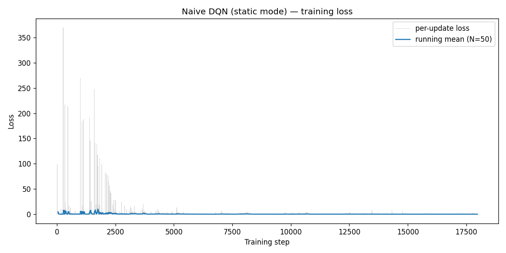

**DQN + Replay（static mode）**
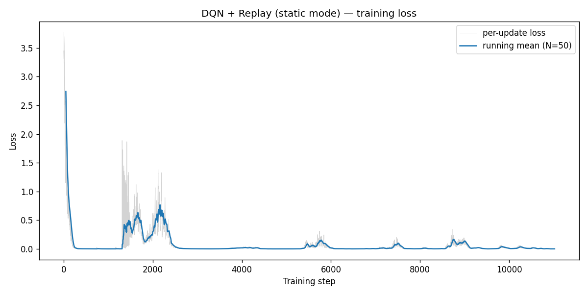

**DQN + Replay（random mode）**
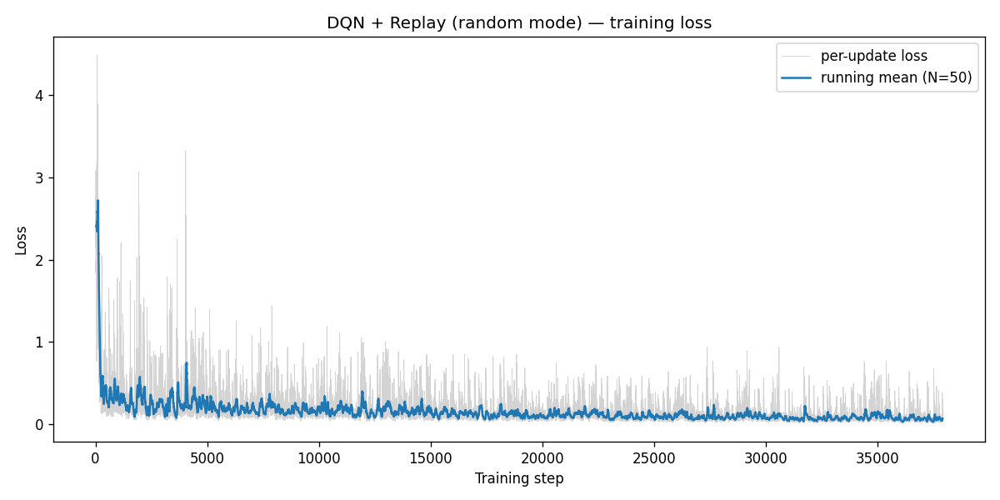

**觀察**：在相同 static 環境下，Naive 的 final loss mean = 0.006、std = 0.010；Replay 版本的 mean = 0.0014（小一個數量級）、std = 0.0003（小 30 倍以上）。Random mode 下因為棋盤分布持續變化，loss 整體偏大（mean 0.0613、std 0.0573），但仍持續收斂。

**解釋**：Replay Buffer 透過 minibatch 隨機抽樣，把單一 transition 帶來的高 variance 平均掉，使梯度估計更穩定。在 random mode 下 loss 偏大是因為網路要同時擬合多種棋盤佈局；最終 loss 仍下降證明 Replay 成功對抗了非平穩分布。

### 2. 學到的策略行為（量化指標）

| 實驗 | Mode | 方法 | Win Rate（1000 場 test） | 平均勝場步數 | Final Loss (mean ± std) | 訓練時間 |
|---|---|---|---|---|---|---|
| 1 | static | Naive DQN | **100.0%** | 7.0（最短路） | 0.006 ± 0.010 | 4.26s |
| 2 | static | DQN + Replay | **100.0%** | 7.0 | 0.0014 ± 0.0003 | 5.26s |
| 3 | random | DQN + Replay | **85.5%** | 2.56 | 0.0613 ± 0.0573 | 18.11s |

**觀察**：在 static mode 下，Naive 與 Replay 皆達到 100% 勝率、且都走出 7 步最短路。Random mode 的 Replay 達到 85.5% 勝率（書本 baseline 89.4%）；平均勝場步數降至 2.56，遠低於 static 的 7.0。

**解釋**：static 下兩種方法表現相同是合理的 — 棋盤永遠相同，沒有樣本相關性問題、也沒有 catastrophic forgetting；Replay 的優勢主要展現在 loss 穩定度而非勝率本身。Random mode 的 `avg_steps = 2.56` 看似「跑得更快」，實則是隨機棋盤常將 Player 與 Goal 放在相鄰格，這些「容易場」拉低平均；真正困難的初始配置（Goal 被 Wall 半包圍、Player 旁邊就是 Pit）多半落在 14.5% 的失敗組裡。

> **註**：static mode 的最短路為 **7 步**而非 3 步，因為 Pit 位於 (0,1) 阻斷了 (0,3)→(0,0) 的直線，agent 必須繞行第 2 列：down→down→left→left→left→up→up。

### 3. 策略動畫（Dashboard GIF）

每個 GIF 同時呈現兩個面向：**左側**是 4×4 Gridworld 上 agent 的實時走位（P 藍、+ 綠、− 紅、W 灰）；**右側**是訓練 loss 曲線（灰線 = 完整未來曲線、紅線 = 已訓練到當前 epoch、紅虛線 = 當前 snapshot 的 epoch 位置）。

**Naive DQN（static mode）**
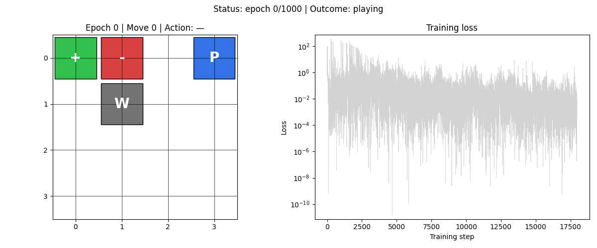

**DQN + Replay（static mode）**


**DQN + Replay（random mode）**
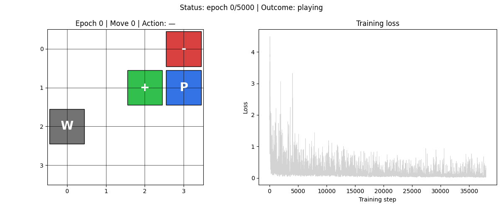

**觀察**：static mode 動畫中，agent 在訓練早期（epoch 0–200）會嘗試走捷徑撞到 Pit/Wall，到 epoch 500 後穩定走出 7 步繞行最短路。Random mode 動畫中，每個 snapshot 對應不同的隨機初始棋盤（用 `random.seed(snap_epoch)` 確保可重現），agent 隨訓練進度逐步學會在多種佈局下都能找到 Goal。

**解釋**：動畫直觀呈現了「策略隨訓練進步」的過程：早期 ε 高 → 隨機亂走或誤判；中期 → 局部正確但偶爾走錯；後期 → 穩定取得最大累積 reward。Loss 曲線同步往下走則印證了 Q 函數估計的收斂與策略改善是一體兩面。

## HW3-2：Enhanced DQN Variants for player mode

於 4×4 Gridworld `player` mode（Player 位置隨機、Goal/Pit/Wall 固定）
比較四種 DQN 變體：DQN+Replay（baseline）、Double DQN、Dueling DQN、
Double+Dueling 合併。完整報告與量化討論見 [`HW3_2_report.md`](HW3_2_report.md)。

### 訓練 Loss 曲線

**Baseline (DQN+Replay)**
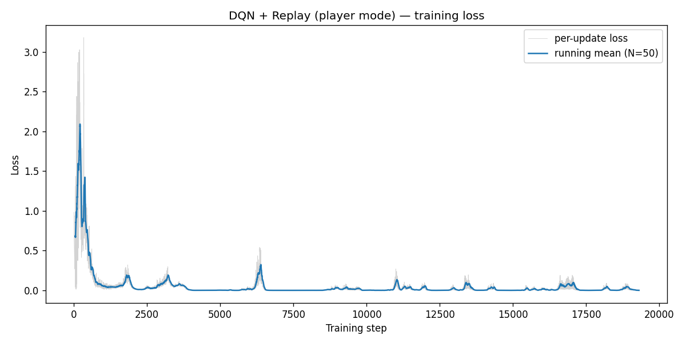

**Double DQN**
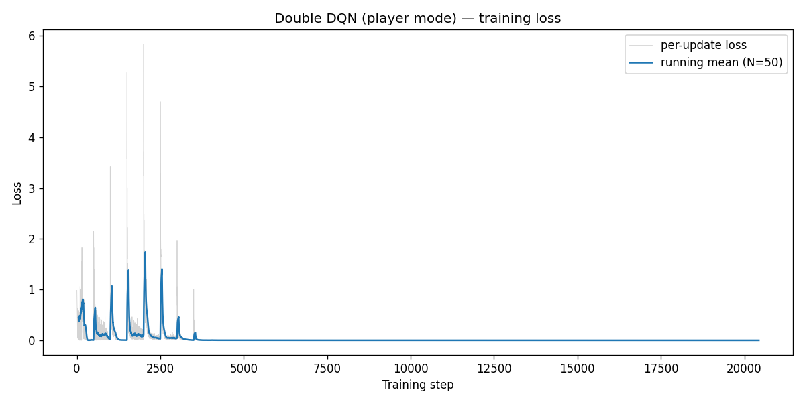

**Dueling DQN**
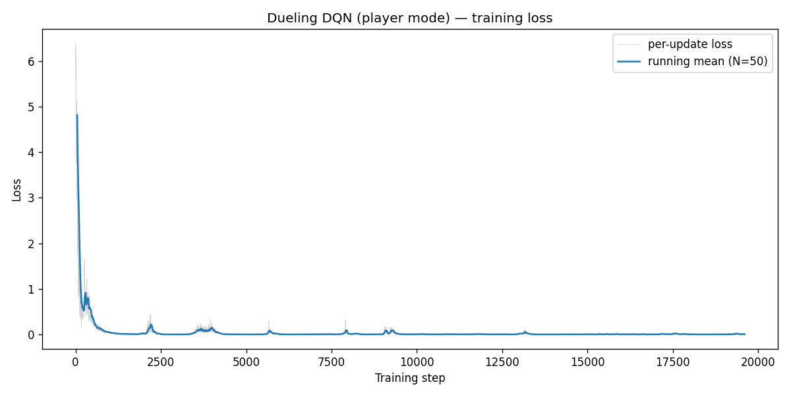

**Double + Dueling**
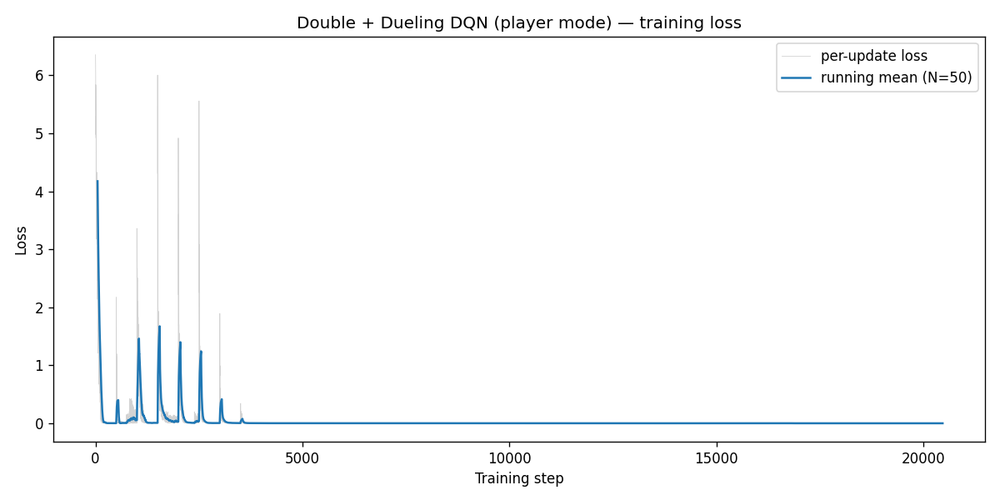

### 量化指標

| 實驗 | Method | Final Loss (mean) | Win Rate | Avg Steps | 訓練時間 |
|---|---|---|---|---|---|
| baseline | replay | 0.00117 | 100.0% | 4.359 | 9.28s |
| Double | double | 0.00050 | 100.0% | 4.389 | 10.33s |
| Dueling | dueling | 0.00528 | 100.0% | 4.317 | 11.08s |
| Combined | double_dueling | 0.00032 | 100.0% | 4.393 | 12.87s |

**觀察**：4 種方法在 player mode 都達到 100% win rate，但 final loss 穩定度
差異一個數量級 — Combined (0.00032) < Double (0.00050) < baseline (0.00117)
< Dueling (0.00528)。Combined 結合 Double 的 target 穩定性 + Dueling 的
V/A 結構，得到最穩定收斂；Dueling 因無 target net 加上更深網路 loss 較
不穩，但 avg_steps_per_win 反而最少（學到最短路徑）。

### 策略動畫

| Baseline | Double | Dueling | Combined |
|---|---|---|---|
| 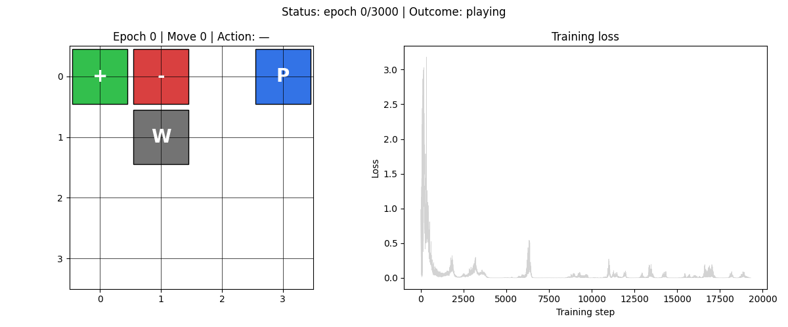 |  |  | 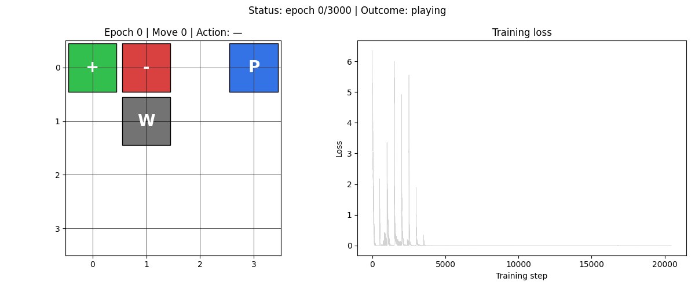 |

## 安裝

需要 **Python 3.12**（PyTorch 對 3.13 / 3.14 的支援尚未完整）。本專案使用 [`uv`](https://github.com/astral-sh/uv) 作為套件管理器以加速 venv 建立與相依鎖定。

```bash
# 1. 安裝 uv（若尚未安裝）
curl -LsSf https://astral.sh/uv/install.sh | sh

# 2. 取得專案
git clone https://github.com/Charles8745/2026DRL_HW3DQN.git
cd 2026DRL_HW3DQN

# 3. 建立 venv 並安裝相依套件
uv venv --python 3.12
source .venv/bin/activate
uv pip install -r requirements.txt
```

## 使用方式

### 執行三組訓練實驗

```bash
source .venv/bin/activate

python -m src.dqn_naive  --mode static --epochs 1000 --seed 42   # Naive DQN, static
python -m src.dqn_replay --mode static --epochs 1000 --seed 42   # DQN + Replay, static
python -m src.dqn_replay --mode random --epochs 5000 --seed 42   # DQN + Replay, random

# HW3-2 (player mode)
python -m src.dqn_replay         --mode player --epochs 3000 --seed 42 \
       --out-dir results/HW3-2/replay_player
python -m src.dqn_double         --mode player --epochs 3000 --seed 42
python -m src.dqn_dueling        --mode player --epochs 3000 --seed 42
python -m src.dqn_double_dueling --mode player --epochs 3000 --seed 42
```

每組訓練的產物會寫入 `results/HW3-1/<exp>/`（包含 `loss.png`、`metrics.json`、`checkpoint.pth`、`losses.npy`、`snapshots/`）。

### 生成 Dashboard 動畫 GIF

```bash
python -m src.animate --exp naive_static
python -m src.animate --exp replay_static
python -m src.animate --exp replay_random
python -m src.animate --exp replay_player
python -m src.animate --exp double_player
python -m src.animate --exp dueling_player
python -m src.animate --exp combined_player
```

### 執行測試

```bash
pytest -v
```

預期 33 個測試全綠（HW3-1 24 + HW3-2 9）。

## 設定

主要 hyperparameters 可透過 CLI flag 調整：

**`src/dqn_naive.py`**
- `--mode`：`static` / `player` / `random`
- `--epochs`、`--gamma`、`--lr`、`--seed`、`--snapshot-every`、`--out-dir`
- `--epsilon-start`、`--epsilon-end`（線性衰減 ε）

**`src/dqn_replay.py`**
- 上述全部（除 `--epsilon-start/end` 改為單一 `--epsilon`）
- `--mem-size`、`--batch-size`、`--max-moves`

網路架構由 `src/model.py` 的 `build_model(in_dim, hidden1, hidden2, out_dim)` 控制，預設 `64→150→100→4` 對應 Listing 3.2。

Gridworld 棋盤大小與獎勵值寫死在 `src/gridworld_env.py` 內（為保持與 DRL in Action Ch.3 一致；如需修改可直接編輯）。

## 後續階段

| Stage | 主題 | 狀態 |
|---|---|---|
| **HW3-1**：Naive DQN for static mode | Naive DQN + Experience Replay 對比 | ✅ 已完成 |
| **HW3-2**：Enhanced DQN Variants for player mode | Double DQN + Dueling DQN + 兩者合併（[`HW3_2_report.md`](HW3_2_report.md)） | ✅ 已完成 |
| HW3-3：Framework conversion + training tricks | PyTorch → Keras / PyTorch Lightning + gradient clipping / lr scheduling | ⏳ 規劃中 |

## 授權

本專案以 MIT License 授權。`src/gridboard.py` 與 `src/gridworld_env.py` 改編自 *Deep Reinforcement Learning in Action* 第 3 章（Alexander Zai、Brandon Brown，Manning 2020），原作者版權歸原作者所有。詳見 [LICENSE](LICENSE)。
