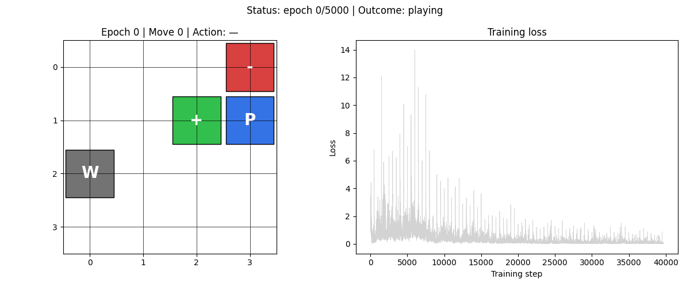
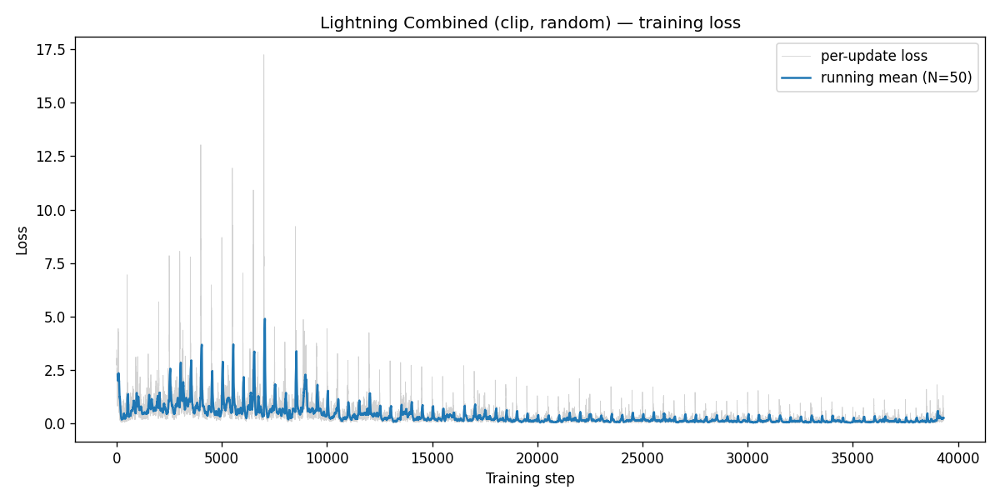
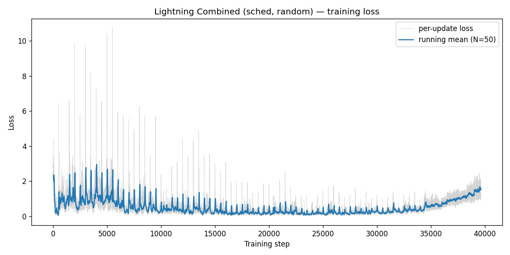
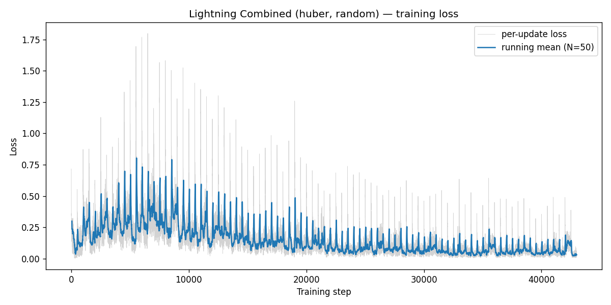
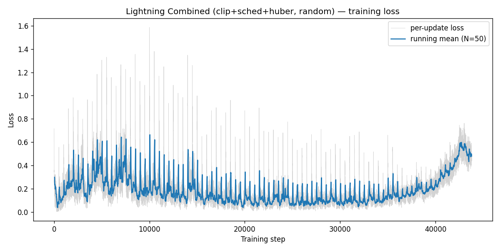
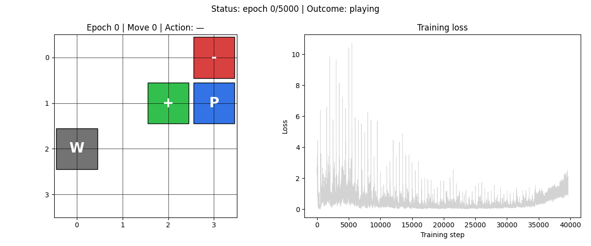
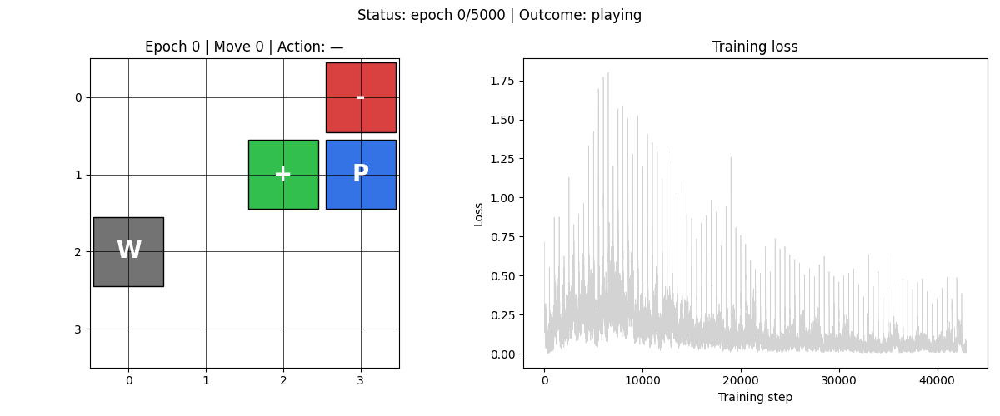
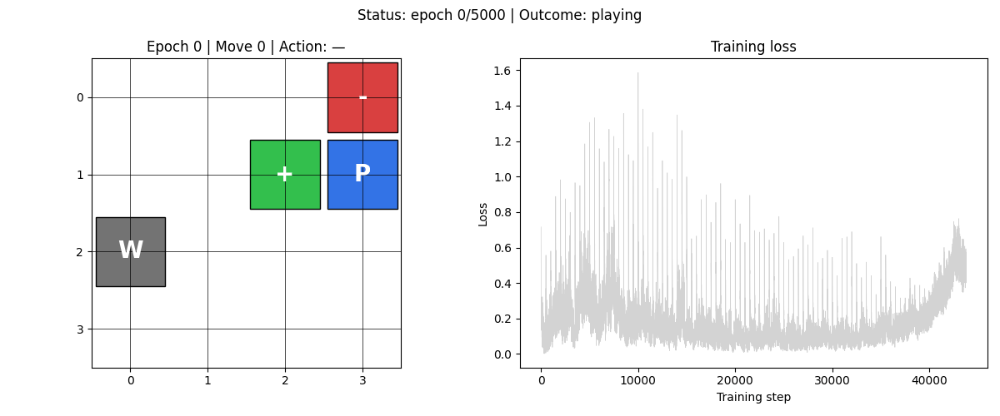

# HW3：Naive DQN → Enhanced DQN Variants 於 Gridworld 環境

> **課程**：深度強化學習 HW3 — DQN and its variants
> **階段**：HW3-1 ✅ + HW3-2 ✅ + HW3-3 ✅ + **HW3-4 ✅（本次更新，加分題）**
> **Repo**：https://github.com/Charles8745/2026DRL_HW3DQN

## 簡介

這份作業在 4×4 Gridworld 上分四階段實作 DQN 系列演算法，每階段都跟前一階段做對比，看每個改進到底有沒有用。

HW3-1 是課程 baseline：Naive DQN（每個 transition 立即更新）對 DQN + Experience Replay（環形 buffer 抽 minibatch）。在 `static` 跟 `random` 兩種棋盤上各跑一次。

HW3-2 加兩個經典改進：Double DQN（Hasselt 2016；online 選動作、target 算價值，壓 Q 高估）、Dueling DQN（Wang 2016；網路拆 V(s) 跟 A(s,a) 雙頭、用 mean-baseline aggregate）。把兩個合在一起的 Combined 預期最強。全部跑 `player` mode。HW3-2 baseline 直接重跑 HW3-1 的 `dqn_replay.py`，Double 跟 Dueling 各自的貢獻才不會混在一起。

HW3-3 把 Combined 移植到 PyTorch Lightning、再加三個訓練技巧消融：gradient norm clipping（`max_norm=10.0`）、CosineAnnealingLR（`eta_min=1e-5`）、Huber loss。5 組組合（baseline / clip / sched / huber / full）全跑 `random` mode。

HW3-4（加分題、本次更新）做完整 Rainbow：HW3-2 已有的 Double + Dueling，再疊上 PER、N-step、C51 distributional、Noisy Nets 共 6 個元件。2 組實驗：`combined_random` 是 HW3-3 baseline 重跑當對照組，`rainbow_random` 是主角。結果出乎意料：Rainbow 收 21.7% win rate，比 baseline 的 88% 還慘。原因分析在 [`HW3_4_report.md`](HW3_4_report.md)。

## 四階段一覽

每階段挑一個代表實驗放在同一張表：

| Stage | 環境 | 代表實驗 | Win rate | Loss (mean ± std) | 訓練時間 | 一句話定位 |
|---|---|---|---|---|---|---|
| **HW3-1** | `random` | DQN + Replay | 85.5% | 0.0613 ± 0.0573 | 18.11s | 課程 baseline，非平穩棋盤是真痛點 |
| **HW3-2** | `player` | Combined (Double+Dueling) | 100.0% | **0.00032 ± 0.00010** | 12.87s | 4 變體中 loss 最穩；player mode 對勝率太簡單，差異要看 loss |
| **HW3-3** | `random` | Lightning Combined（無 tricks） | **88.0%** | **0.0315 ± 0.0174** (MSE) | 31.87s | Lightning 移植 + Combined 把 HW3-1 random 的 loss mean 砍半、std 砍 70% |
| **HW3-4** | `random` | Rainbow（6 元件全套） | **21.7%** | 0.6409 ± 0.2229 (KL) | 511.82s | 過度工程的反例，4×4 Gridworld 太小、Rainbow 反而崩塌 |

random mode 上看 HW3-1 → HW3-3：win rate 從 85.5% 到 88.0%、loss mean 從 0.061 砍到 0.032。HW3-3 → HW3-4 想再加 4 個元件（PER、N-step、C51、Noisy），結果跌到 21.7%，比隨機亂走（約 25–30%）還差。一句話總結：演算法複雜度要跟任務規模對得上。Rainbow 在 Atari 上 6 元件互相加乘，搬到 4×4 Gridworld 反而互相打架。詳細分析在 [`HW3_4_report.md`](HW3_4_report.md)。

### 四段策略動畫對照

每階段挑一個代表實驗：

| HW3-1: Replay (random)<br/>85.5% win rate | HW3-2: Combined (player)<br/>100% win rate |
|---|---|
|  |  |

| HW3-3: Lightning Combined (random)<br/>88.0% win rate | HW3-4: Rainbow (random)<br/>21.7% win rate |
|---|---|
|  |  |

GIF 左半是 agent 在 4×4 棋盤上的 greedy rollout，右半是 loss 曲線（紅實線是訓練到當前 epoch、紅虛線是 snapshot 位置、灰線是整段曲線）。HW3-1 random 那條 loss 明顯抖，HW3-2 player 那條幾乎是直線，HW3-3 random 介於中間。HW3-4 那條 KL loss 跟前三條 MSE 量綱不可直接比，但看 agent 一路撞牆走 pit 也知道策略沒學起來。

## 特色

- Gridworld 環境直接從 *Deep Reinforcement Learning in Action*（Manning, 2020）Ch.3 移植過來，邏輯不動、只加 attribution
- 三個網路工廠並存：`build_model`（HW3-1 / Double DQN，`64→150→100→4` Sequential）、`build_dueling_model`（HW3-2 Dueling 與 Combined、HW3-3 Lightning Combined、HW3-4 combined_random，trunk + V/A 雙頭 + mean-baseline）、`build_rainbow_model`（HW3-4 rainbow，DistributionalDuelingMLP + NoisyLinear V/A 雙頭 + 51 atoms）
- 七個獨立可執行的訓練腳本（`dqn_naive` / `dqn_replay` / `dqn_double` / `dqn_dueling` / `dqn_double_dueling` / `dqn_lightning` / `rainbow`），每個檔案自帶完整 CLI。一個變體一個檔，diff 自 baseline 一眼看懂
- 每組訓練自動每 50 / 150 / 250 epochs 存 snapshot，`animate.py` 用 model factory dispatch 自動載入對應網路畫 GIF
- 每組實驗都產出 loss 曲線 PNG、勝率/步數 JSON、dashboard GIF
- 71 個 pytest 測試覆蓋環境、模型（含 DuelingMLP 的 zero-mean 性質、NoisyLinear 的 noise reset、SumTree 的 O(log N) 行為）、工具、7 種訓練腳本、動畫各模組

## 專案結構

- `src/`：所有原始碼
  - `gridboard.py` / `gridworld_env.py`：Gridworld 環境（從書 Ch.3 移植）
  - `model.py`：`build_model` + `DuelingMLP` / `build_dueling_model`
  - `utils.py`：種子設定、state encoding、ε-greedy、test_model、evaluate
  - `dqn_naive.py`：Naive DQN 訓練 + CLI（HW3-1，Listing 3.3）
  - `dqn_replay.py`：DQN + Experience Replay 訓練 + CLI（HW3-1，Listing 3.5；HW3-2 baseline 也用此檔重跑）
  - `dqn_double.py`：Double DQN 訓練 + CLI（HW3-2）
  - `dqn_dueling.py`：Dueling DQN 訓練 + CLI（HW3-2）
  - `dqn_double_dueling.py`：Double + Dueling 合併訓練 + CLI（HW3-2）
  - `dqn_lightning.py`：PyTorch Lightning 版 Combined DQN + 3 tricks + CLI（HW3-3）
  - `rainbow.py`：完整 Rainbow DQN（NoisyLinear + DistributionalDuelingMLP + SumTree + PER + NStepBuffer + categorical projection + 訓練迴圈 + CLI，單檔 ~700 LOC）（HW3-4）
  - `animate.py`：Dashboard GIF 生成（model factory dispatch 支援三種網路）
- `tests/`：pytest 測試（11 個檔案，71 個測試）
- `results/HW3-1/`：HW3-1 三組實驗的訓練產物（`naive_static/`、`replay_static/`、`replay_random/`）
- `results/HW3-2/`：HW3-2 四組實驗的訓練產物（`replay_player/`、`double_player/`、`dueling_player/`、`combined_player/`）
- `results/HW3-3/`：HW3-3 五組實驗的訓練產物（`baseline_random/`、`clip_random/`、`sched_random/`、`huber_random/`、`full_random/`）
- `results/HW3-4/`：HW3-4 兩組實驗的訓練產物（`combined_random/`、`rainbow_random/`）
- `docs/superpowers/`：四階段的設計文件（`specs/`）與實作計畫（`plans/`）
- [`HW3_1_report.md`](HW3_1_report.md)：HW3-1 中文短報告（含完整原理推導與程式碼解讀）
- [`HW3_2_report.md`](HW3_2_report.md)：HW3-2 中文短報告（Double / Dueling / Combined 原理與比較）
- [`HW3_3_report.md`](HW3_3_report.md)：HW3-3 中文短報告（Lightning 移植 + 三個 tricks 消融）
- [`HW3_4_report.md`](HW3_4_report.md)：HW3-4 中文報告（完整 Rainbow + 失敗模式分析）

## HW3-1 分析結果

### 1. 訓練 Loss 曲線

**Naive DQN（static mode）**


**DQN + Replay（static mode）**


**DQN + Replay（random mode）**


static 上 Naive 的 final loss mean=0.006、std=0.010；Replay 直接降一個數量級到 mean=0.0014、std=0.0003（差 30 倍以上）。Random mode loss 整體大很多（mean=0.0613、std=0.0573），不過從訓練曲線看還是一路往下走。

Replay 之所以穩，是因為從 buffer 抽 minibatch 把單筆 transition 的 noise 平均掉了。Random mode 的 loss 大則是因為網路同時要 fit 各種棋盤、難度本來就不一樣。能持續下降代表 Replay 在非平穩分布上還是有效。

### 2. 學到的策略行為（量化指標）

| 實驗 | Mode | 方法 | Win Rate（1000 場 test） | 平均勝場步數 | Final Loss (mean ± std) | 訓練時間 |
|---|---|---|---|---|---|---|
| 1 | static | Naive DQN | **100.0%** | 7.0（最短路） | 0.006 ± 0.010 | 4.26s |
| 2 | static | DQN + Replay | **100.0%** | 7.0 | 0.0014 ± 0.0003 | 5.26s |
| 3 | random | DQN + Replay | **85.5%** | 2.56 | 0.0613 ± 0.0573 | 18.11s |

static 上 Naive 跟 Replay 都到 100% 勝率，也都走出 7 步繞行最短路。Random 的 Replay 拿到 85.5%（書本 baseline 是 89.4%），平均勝場步數降到 2.56，比 static 的 7.0 短很多。

static 下兩種方法打成平手其實合理，棋盤固定、樣本沒相關性也沒 catastrophic forgetting，Replay 的好處主要在 loss 穩定度而不是勝率。Random 的 `avg_steps=2.56` 看起來「跑得更快」是錯覺：隨機棋盤常常把 Player 跟 Goal 放在相鄰格，那些 1–2 步就贏的「送分題」把平均拉低，真正難的局面（Goal 被 Wall 半包圍、Player 旁邊就是 Pit）大多進了 14.5% 的失敗組。

> **註**：static mode 的最短路為 **7 步**而非 3 步，因為 Pit 位於 (0,1) 阻斷了 (0,3)→(0,0) 的直線，agent 必須繞行第 2 列：down→down→left→left→left→up→up。

### 3. 策略動畫（Dashboard GIF）

GIF 左半是 agent 在棋盤上的實時走位（P 藍、+ 綠、− 紅、W 灰），右半是訓練 loss 曲線（灰線是完整曲線、紅線是已訓練到當前 epoch 的部分、紅虛線標記當前 snapshot 的 epoch 位置）。

**Naive DQN（static mode）**


**DQN + Replay（static mode）**


**DQN + Replay（random mode）**


static 動畫裡，agent 早期（epoch 0–200）想走捷徑、被 Pit 跟 Wall 擋下；epoch 500 之後就穩定走出 7 步繞行最短路。Random 動畫每個 snapshot 對應一張不同的隨機棋盤（用 `random.seed(snap_epoch)` 確保可重現），agent 隨訓練逐步學會在各種佈局下找到 Goal。

整段看下來就是「策略慢慢長出來」的過程：早期 ε 大、亂走或被 Pit 騙到；中期局部正確、偶爾還是走錯；後期就穩了。Loss 曲線同步往下，Q 函數收斂跟策略好不好本來就是同一件事的兩個切面。

## HW3-2 分析結果

### 0. 環境與變體簡介

HW3-2 4 組為什麼都跑 `player`：這個 mode 把 Goal、Pit、Wall 釘死，只讓 Player 起點隨機（共 13 種）。狀態空間比 static（單張棋盤）大一個數量級，比 random（幾百張）小一個數量級。剛好夠拉開變體之間的差異又不會被 noise 蓋過。

**4 組實驗的對應關係**：

| 實驗 | 演算法 | 改進於 baseline 的點 |
|---|---|---|
| `replay_player` | DQN + Replay（重跑 HW3-1） | 無，作為對照基準 |
| `double_player` | Double DQN | 引入 Target Network；用 online net 選動作、target net 算價值，解 Q 值高估 |
| `dueling_player` | Dueling DQN | 網路拆 V(s) + A(s,a) 兩支 + mean-baseline aggregation，解 sample inefficiency |
| `combined_player` | Double + Dueling | 兩種改進正交疊加 |

所有 4 組共用相同 hyperparameters：`epochs=3000, gamma=0.9, lr=1e-3, mem_size=1000, batch_size=200, max_moves=50, epsilon=0.3, seed=42`；Double / Combined 額外用 `sync_freq=500`（hard target sync）。

### 1. 訓練 Loss 曲線

**Baseline (DQN+Replay)**


**Double DQN**


**Dueling DQN**


**Double + Dueling**


Final loss mean 從低到高排：Combined (0.00032) < Double (0.00050) < baseline (0.00117) < Dueling (0.00528)，最高跟最低差一個數量級。Double 比 baseline 低 57%、std 從 0.00046 降到 0.00008（差 5.7 倍）；Combined 又比 Double 再低 36%；Dueling 反過來比 baseline 高 4.5 倍、std 也最大（0.00500）。

Double 之所以穩，是把「選動作」跟「估值」拆給 online 跟 target 兩個網路，max 操作不會再把同一份估計誤差放大成 Q 高估，這就是 Hasselt 2016 講的標準效應。Dueling 的 loss 反而偏大是另一個 trade-off 的代價：沒用 target network、又把網路加深成 V/A 雙頭，每次 update 影響更多參數、抖動就明顯了。Combined 把兩個改進疊起來，target net 顧穩定性、V/A 結構顧 sample efficiency，所以 loss 是 4 組最低也最穩。

### 2. 學到的策略行為（量化指標）

| 實驗 | Method | Win Rate（1000 場 test） | 平均勝場步數 | Final Loss (mean ± std) | 訓練時間 |
|---|---|---|---|---|---|
| baseline_player | replay | **100.0%** | 4.359 | 0.00117 ± 0.00046 | 9.28s |
| double_player | double | **100.0%** | 4.389 | 0.00050 ± 0.00008 | 10.33s |
| dueling_player | dueling | **100.0%** | **4.317**（最短） | 0.00528 ± 0.00500 | 11.08s |
| combined_player | double_dueling | **100.0%** | 4.393 | **0.00032 ± 0.00010**（最穩） | 12.87s |

4 個方法在 player mode 都收 100% win rate，勝率分不出差異。看得出差異的是 loss 穩定度（Combined 最穩、Dueling 最抖）跟 avg_steps_per_win（Dueling 反而最短，4.317，比其他三組少 0.07 步）。訓練時間上 Double 跟 Combined 多跑一份網路前向，多了 11–39%；Dueling trunk 共用，只多 19%。

13 種起點配 3000 epochs 對任何合理變體都太簡單，全收 100% 是意料之中。要分出差異就只能看 loss 穩定度跟 sample efficiency。Dueling 的「avg_steps 最少」是個意外副作用：V/A 拆解讓網路一旦學到「state 價值」就更積極往高 V 方向走，自然找到比較短的路；代價是 loss 抖動。Combined 把 Double（改 target 算法）跟 Dueling（改網路結構）疊起來剛好可以用，因為作用點根本不重疊。

### 3. 策略動畫（Dashboard GIF）

| Baseline | Double DQN |
|---|---|
|  |  |

| Dueling DQN | Double + Dueling |
|---|---|
|  |  |

每個 GIF 是 21 個 snapshot（epoch 0、150、300、…、3000）下的 greedy rollout，每個 snapshot 用 `random.seed(snap_epoch)` 重置 player 起點，跨變體可比較。

早期 snapshot（epoch 0–450）4 個變體都還在亂走，網路根本還沒學到 Q 函數。Combined 在 epoch 600 左右就穩定走最短路，Double 約 epoch 750 跟上，baseline 跟 Dueling 要 epoch 900–1050 才到位。後期所有變體都能在多種起點下穩定走到 Goal，跟 100% win rate 對得上。右半 loss 曲線同步往下：Combined 最平滑、Dueling 最抖，跟量化指標一致。

動畫把「兩個改進怎麼加快策略形成」演了出來。Double 的 target 網路讓 Q 估計穩定、策略提早成形；Dueling 共用 V(s)，加速「在這個 state 該往哪走」的學習；兩個一起用時策略最早穩、最少抖。Dueling 中期常常「找到捷徑但偶爾撞牆」，跟它較高的 loss std 也對得起來。

## HW3-3 分析結果

HW3-3 把 HW3-2 最強的 Combined 移植到 PyTorch Lightning，然後在 `random` mode 上加三個 training tricks（gradient clipping、CosineAnnealingLR、Huber loss）做 5 組消融。回到 random mode 是因為 player mode 上 4 個 HW3-2 變體都已經 100%，要量化 trick 的影響就只能回到還沒解完的 random。

### 1. 訓練 Loss 曲線

| Baseline（無 tricks） | +Gradient Clipping |
|---|---|
|  |  |

| +CosineAnnealingLR | +Huber Loss |
|---|---|
|  |  |

| +All Tricks | |
|---|---|
|  | |

### 2. 量化指標（5 組對比）

| 變體 | Method | Final Loss (mean ± std) | Win Rate | Avg Steps | Wall time |
|---|---|---|---|---|---|
| baseline | lightning_combined | **0.03151 ± 0.01744** | **88.0%** | 2.62 | 31.87s |
| clip | lightning_combined +clip | 0.25081 ± 0.14592 | 85.2% | 2.61 | 34.13s |
| sched | lightning_combined +sched | 1.52610 ± 0.29979 | 87.4% | 2.64 | 32.28s |
| huber | lightning_combined +huber | 0.03216 ± 0.01878 | 81.0% | 2.64 | 34.77s |
| full | lightning_combined +clip+sched+huber | 0.48854 ± 0.04443 | 86.3% | 2.61 | 36.94s |

> **註**：表中所有數值直接讀自 `results/HW3-3/<tag>_random/metrics.json`。

結果跟預期相反：baseline 比任何加 trick 的版本都好。第一輪數據出來時我以為是實作 bug，重讀 metrics 跟訓練 log 才整理出原因，大致是三件事交織在一起。

一、Combined 大概已經摸到 4×4 Gridworld 的 ceiling 了。HW3-1 replay_random 在 random mode 是 85.5% / loss 0.0613±0.0573；換成 Lightning Combined 直接到 88.0% / loss 0.0315±0.0174，loss mean 降一半、std 降到三成。Double + Dueling 已經把 random mode 兩個主要痛點（Q 高估、sample inefficiency）處理掉，後面再加 trick 能撈的邊際本來就小。

二、超參尺度不對。`max_norm=10.0`、`eta_min=1e-5`、Huber `β=1.0` 都是 DQN 文獻寫給 Atari CNN（百萬參數）那種網路用的；這裡是 30K 參數的小 MLP，gradient norm 跟 loss landscape 完全不在同個量級。10.0 的 norm clip 對小網路反而會限制正常更新；1e-5 的 eta_min 在 1e-3 起步的小 lr 上幾乎是直接歸零。

三、5000 epochs 對 cosine 退火太短。CosineAnnealingLR 把最後 1000 個 epoch 的 lr 推到 1e-5，模型那段時間幾乎沒更新、loss 一路累積成那條 1.526 的曲線（看 sched 那欄就知道）。

換個角度看，HW3-3 真正的進步其實在 baseline 那行 — 同樣 random mode，loss 從 0.0613 砍到 0.0315、win rate 從 85.5% 到 88.0%。Lightning 移植加 Combined 演算法本身就把 baseline 拉起來了，trick 想再錦上添花、但這次沒添到。

### 3. 策略動畫

| Baseline | +Gradient Clipping |
|---|---|
|  |  |

| +CosineAnnealingLR | +Huber Loss |
|---|---|
|  |  |

| +All Tricks | |
|---|---|
|  | |

> **詳細分析**：見 [HW3_3_report.md](HW3_3_report.md)。

## HW3-4 分析結果

HW3-4 把 Hessel et al. 2018 的 Rainbow 完整做出來，疊在 HW3-3 baseline 之上：HW3-2 已經有的 Double + Dueling，再加 PER、N-step、C51 distributional、Noisy Nets。共 2 組實驗，都跑 random mode、seed=42、5000 epochs。

### 1. 量化指標（2 組對比）

| 變體 | Method | Win Rate | Avg Steps | Final Loss (mean ± std) | Wall time |
|---|---|---|---|---|---|
| `combined_random` | lightning_combined | **88.0%** | 2.62 | 0.0315 ± 0.0174 (MSE) | 31.47s |
| `rainbow_random` | rainbow | **21.7%** | 2.05 | 0.6409 ± 0.2229 (KL) | 511.82s |

`combined_random` 是 HW3-3 Lightning Combined 直接重跑，重現 HW3-3 那組 88.0% win rate 當作 HW3-4 的對照 baseline。`rainbow_random` 把 6 元件全套跑出來，win rate 跌到 21.7%，比 baseline 88% 差一截，連完全隨機亂走的 25–30% 都不如。

### 2. Loss 曲線

| `combined_random`（MSE） | `rainbow_random`（KL） |
|---|---|
|  |  |

兩條曲線都單調下降，KL 從 4 左右收到 0.6，從 loss 看訓練「正常」。但 win rate 顯示 Rainbow 收斂到一個錯的目標分佈。把 checkpoint 拿出來逐棋盤檢查，Q 值在四個動作之間幾乎一樣（全聚在 −9.85 附近）、return 分佈把 60–80% 機率質量壓在 z = −10 那個 atom 上。意思是 agent 學會「不管做什麼下場都是死」。

### 3. 策略動畫

| `combined_random`（88.0%） | `rainbow_random`（21.7%） |
|---|---|
|  |  |

`combined_random` 跟 HW3-3 baseline 走起來幾乎一樣（早期亂走、後期穩定走最短路）。`rainbow_random` 整個訓練過程都在撞牆、走進 pit、或徘徊到 max_moves 截止。loss 在收斂，但策略沒有收斂。

> 完整的失敗模式診斷、3 組 hyperparameter 嘗試、Rainbow 在 4×4 Gridworld 失效的理論解釋，整理在 [HW3_4_report.md](HW3_4_report.md)。

## 安裝

需要 **Python 3.12**（PyTorch 對 3.13 / 3.14 的支援尚未完整）。本專案使用 [`uv`](https://github.com/astral-sh/uv) 作為套件管理器以加速 venv 建立與相依鎖定。

```bash
# 1. 安裝 uv（若尚未安裝）
curl -LsSf https://astral.sh/uv/install.sh | sh

# 2. 取得專案
git clone https://github.com/Charles8745/2026DRL_HW3DQN.git
cd 2026DRL_HW3DQN

# 3. 建立 venv 並安裝相依套件
uv venv --python 3.12
source .venv/bin/activate
uv pip install -r requirements.txt
```

## 使用方式

### 執行訓練實驗

```bash
source .venv/bin/activate

# HW3-1 (static / random mode)
python -m src.dqn_naive  --mode static --epochs 1000 --seed 42   # Naive DQN, static
python -m src.dqn_replay --mode static --epochs 1000 --seed 42   # DQN + Replay, static
python -m src.dqn_replay --mode random --epochs 5000 --seed 42   # DQN + Replay, random

# HW3-2 (player mode)
python -m src.dqn_replay         --mode player --epochs 3000 --seed 42 \
       --snapshot-every 150 --out-dir results/HW3-2/replay_player
python -m src.dqn_double         --mode player --epochs 3000 --seed 42
python -m src.dqn_dueling        --mode player --epochs 3000 --seed 42
python -m src.dqn_double_dueling --mode player --epochs 3000 --seed 42

# HW3-4 (random mode)
python -m src.dqn_lightning --mode random --epochs 5000 --seed 42 \
       --snapshot-every 250 --out-dir results/HW3-4/combined_random
python -m src.rainbow                                         # rainbow defaults
```

每組訓練的產物會寫入 `results/HW3-{1,2,3,4}/<exp>/`（包含 `loss.png`、`metrics.json`、`checkpoint.pth`、`losses.npy`、`snapshots/`）。

### 生成 Dashboard 動畫 GIF

```bash
# HW3-1
python -m src.animate --exp naive_static
python -m src.animate --exp replay_static
python -m src.animate --exp replay_random

# HW3-2
python -m src.animate --exp replay_player
python -m src.animate --exp double_player
python -m src.animate --exp dueling_player
python -m src.animate --exp combined_player

# HW3-4
python -m src.animate --exp combined_random
python -m src.animate --exp rainbow_random
```

`animate.py` 會根據 exp 名稱自動選擇對應的 model factory（HW3-4 rainbow 用 `build_rainbow_model`，HW3-2 dueling / combined 與 HW3-3 / HW3-4 combined_random 用 `build_dueling_model`，其它用 `build_model`）與輸出目錄前綴。

### 執行測試

```bash
pytest -v
```

預期 71 個測試全綠（HW3-1 24 + HW3-2 9 + HW3-3 16 + HW3-4 22）。

## 設定

主要 hyperparameters 可透過 CLI flag 調整：

**`src/dqn_naive.py`**
- `--mode`：`static` / `player` / `random`
- `--epochs`、`--gamma`、`--lr`、`--seed`、`--snapshot-every`、`--out-dir`
- `--epsilon-start`、`--epsilon-end`（線性衰減 ε）

**`src/dqn_replay.py`**
- 上述全部（除 `--epsilon-start/end` 改為單一 `--epsilon`）
- `--mem-size`、`--batch-size`、`--max-moves`

**`src/dqn_double.py` / `src/dqn_double_dueling.py`**
- 同 `dqn_replay.py`，外加 `--sync-freq`（hard target sync 頻率，預設 500 個 training steps）

**`src/dqn_dueling.py`**
- 同 `dqn_replay.py`，無 `--sync-freq`（不使用 target network）

**`src/dqn_lightning.py`** (HW3-3)
- 同 `dqn_double_dueling.py`，外加 `--clip` / `--sched` / `--huber` 三個 tricks 的開關 flag

**`src/rainbow.py`** (HW3-4)
- `--mode`、`--epochs`、`--gamma`、`--lr`、`--mem-size`、`--batch-size`、`--max-moves`、`--sync-freq`、`--seed`、`--snapshot-every`、`--out-dir`
- Rainbow 特有：`--n-step`（n-step 步數）、`--n-atoms` / `--v-min` / `--v-max`（C51 distributional support）、`--alpha` / `--beta-start` / `--beta-end`（PER 抽樣參數）、`--sigma-init`（NoisyLinear 噪音初值）

網路架構由 `src/model.py` 與 `src/rainbow.py` 控制：
- `build_model(in_dim, hidden1, hidden2, out_dim)` — Sequential MLP，預設 `64→150→100→4`（HW3-1 / Double DQN 使用）
- `build_dueling_model(in_dim, hidden1, hidden2, n_actions)` — `DuelingMLP` 含共用 trunk + V/A 雙頭 + mean-baseline aggregation（HW3-2 Dueling / Combined、HW3-3 Lightning Combined、HW3-4 combined_random 使用）
- `build_rainbow_model(...)` — `DistributionalDuelingMLP`：plain trunk + NoisyLinear V/A 雙頭，C51 51 atoms 在 `[-10, +10]`，per-atom dueling aggregation；`forward(state)` 回 expected Q 對齊 HW3-1/2/3 介面（HW3-4 rainbow_random 使用）

Gridworld 棋盤大小與獎勵值寫死在 `src/gridworld_env.py` 內（為保持與 DRL in Action Ch.3 一致；如需修改可直接編輯）。

## 後續階段

| Stage | 主題 | 狀態 |
|---|---|---|
| **HW3-1**：Naive DQN for static mode | Naive DQN + Experience Replay 對比（[`HW3_1_report.md`](HW3_1_report.md)） | ✅ 已完成 |
| **HW3-2**：Enhanced DQN Variants for player mode | Double DQN + Dueling DQN + 兩者合併（[`HW3_2_report.md`](HW3_2_report.md)） | ✅ 已完成 |
| **HW3-3**：Framework conversion + training tricks | PyTorch Lightning + grad clipping / cosine sched / Huber loss（[`HW3_3_report.md`](HW3_3_report.md)） | ✅ 已完成 |
| **HW3-4**：Rainbow DQN（加分題） | 完整 Rainbow（PER + N-step + C51 + Noisy）；負面結果分析（[`HW3_4_report.md`](HW3_4_report.md)） | ✅ 已完成 |

## 授權

本專案以 MIT License 授權。`src/gridboard.py` 與 `src/gridworld_env.py` 改編自 *Deep Reinforcement Learning in Action* 第 3 章（Alexander Zai、Brandon Brown，Manning 2020），原作者版權歸原作者所有。詳見 [LICENSE](LICENSE)。
